<p align="center"></p>

<h1 align="center">Receipt Box</h1>

<p align="center">A receipt archive for a small company. It runs on a Mac that you own.</p>

Send a photo or a PDF of a receipt to a Telegram bot. The Mac keeps the original file. It reads the receipt with on-device OCR and a local vision model. Then it files the receipt or puts it on a short review list.

A private web app shows the receipts by month. It also shows reports and makes exports for the end of the year.

No receipt goes to a cloud AI service. The originals, the database and the recognition stay on your Mac.

## Demo

These screenshots show fictional receipts. They do not show company data.

<p align="center">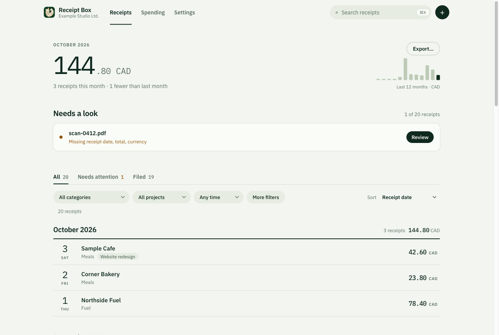</p>

<table>
  <tr>
    <td width="50%">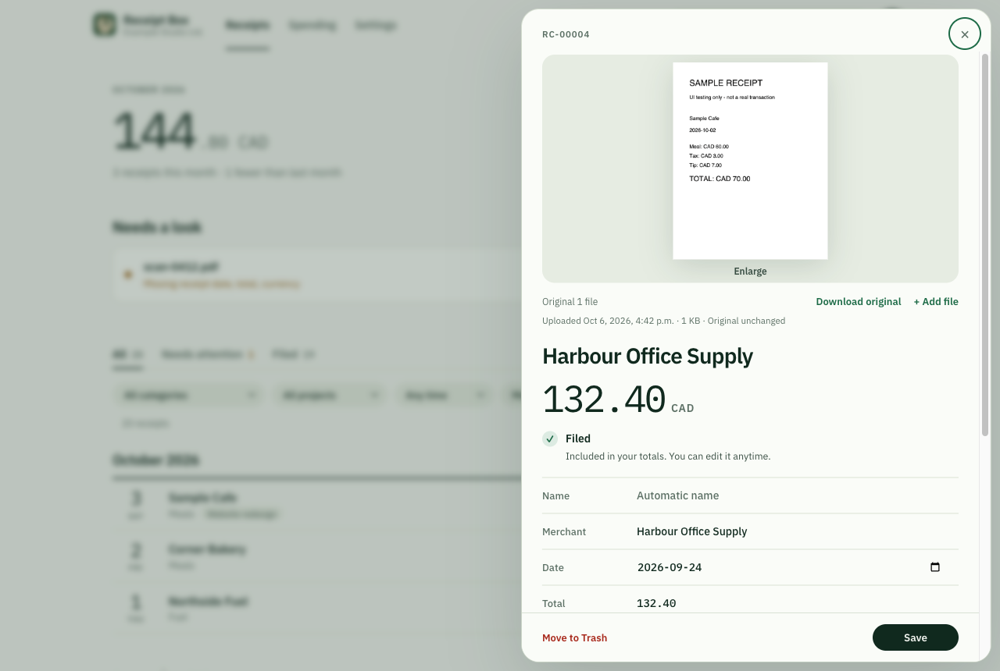</td>
    <td width="50%">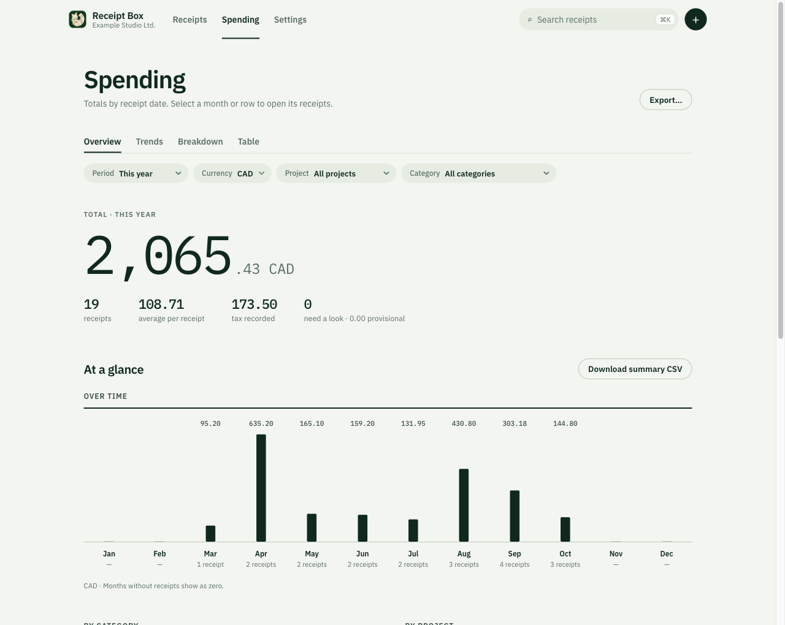</td>
  </tr>
  <tr>
    <td align="center">Receipt details in a drawer</td>
    <td align="center">Spending by month, category and project</td>
  </tr>
</table>

<p align="center">
  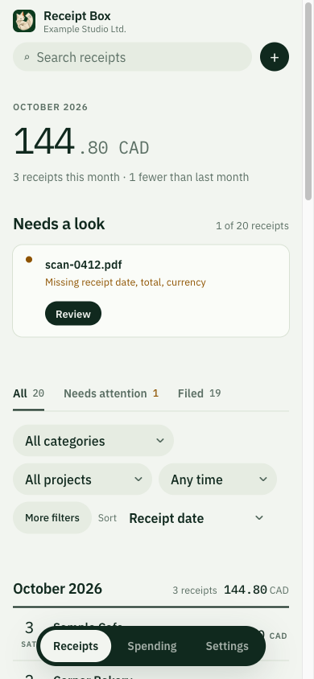
  &nbsp;&nbsp;
  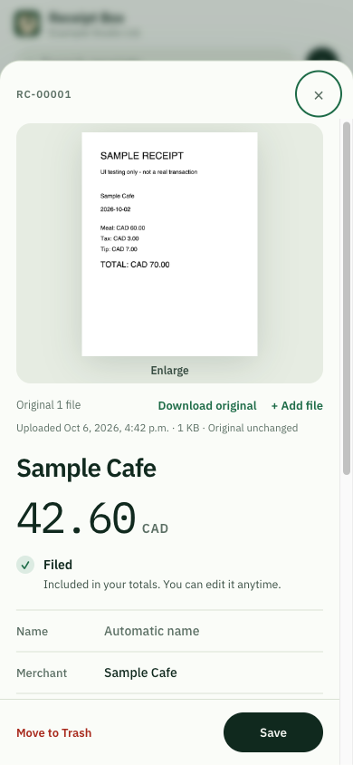
</p>

To see the demo on your Mac, do these steps:

1. Install Node.js 24 or later.
2. Clone this repository.
3. In the repository folder, type `npm run qa`.
4. Open `http://127.0.0.1:4318` in a browser.

The demo uses a temporary folder and one fictional receipt. It does not read or change real data.

## Features

- **Telegram capture.** The bot replies only after the original file and its record are on the disk.
- **On-device recognition.** Apple Vision OCR and a local Ollama vision model read the date, the total, the taxes, the currency and the category.
- **Exceptions only.** If a receipt has a date, a total and a currency, the app files it. All other receipts go to the "Needs a look" list.
- **Originals do not change.** The app keeps each original file under its SHA-256 hash. Each change goes into an audit history.
- **Your edits stay.** The app never replaces a value that a person typed.
- **A ledger by month.** The Receipts page groups receipts by the receipt date. Each month shows its total for each currency.
- **Reports.** The Spending page shows totals by month, by category and by project. Select a bar or a row to see its receipts.
- **Exports.** A ZIP file contains the original files with clear names, a CSV file, an HTML index and a manifest.
- **Projects and members.** Put receipts into projects. Invite other people to send receipts through Telegram.
- **Trash.** Move a receipt to Trash. The owner can empty Trash permanently.
- **Snapshots.** The app makes a verified snapshot each day. It also has an interface for encrypted backups with [restic](https://restic.net).

## How a receipt moves through the system

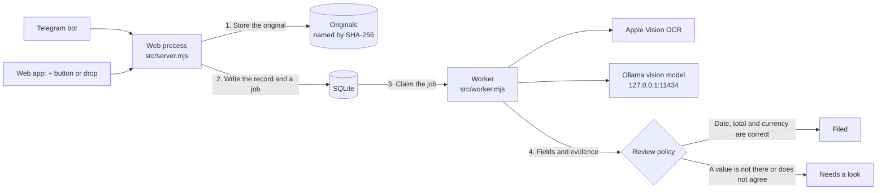

The web process writes the record, the audit event and the recognition job in one SQLite transaction. The worker is a different process. If the worker stops, the job stays in the queue. The next worker starts the job again.

## Receipt states

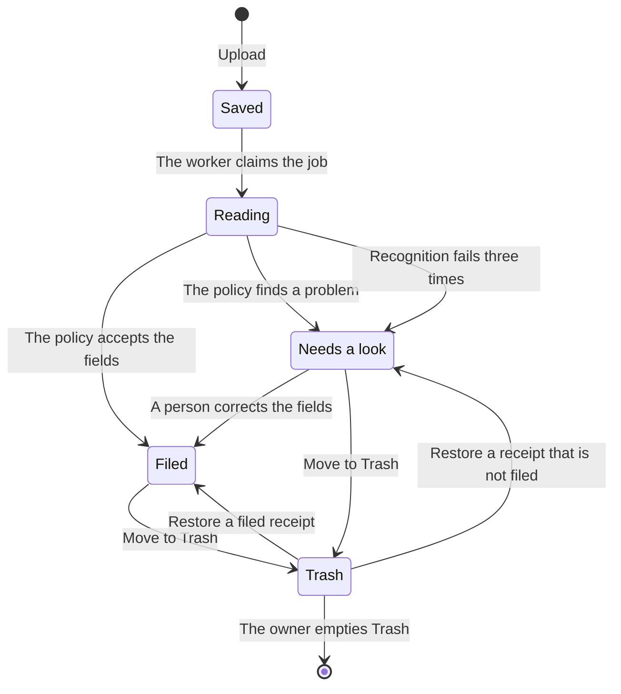

A receipt in Trash is not in the totals or the exports. Restore keeps the original file and the history.

## Telegram sequence

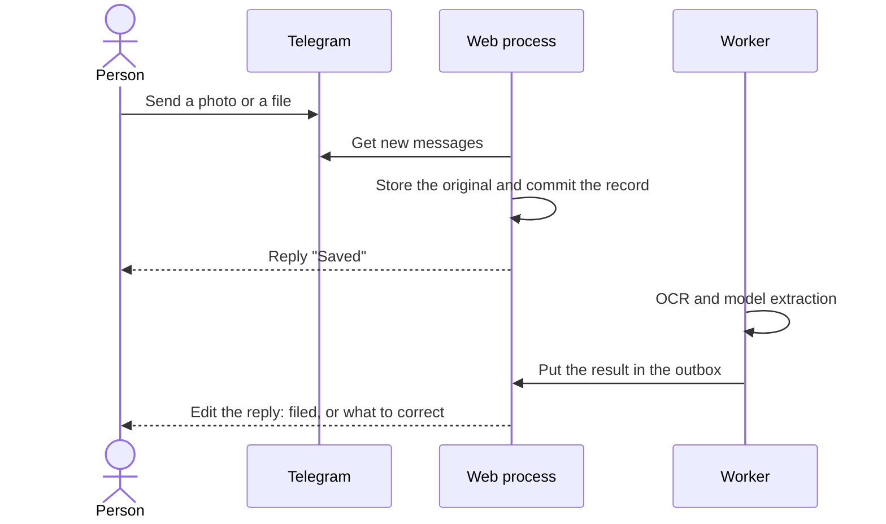

Send a receipt as a file to keep the original bytes. Telegram can compress a photo.

To add data to a receipt, reply to its message. Write one field on each line:

```text
purpose: Client project planning
project: Website redesign
total: 48.40
date: 2026-10-03
```

These fields are available: `purpose`, `people`, `vehicle`, `payer`, `project`, `reimbursement`, `merchant`, `date`, `total`, `tax`, `currency`, `category`, `tip`, `gst`, `hst`, `pst`, `qst`.

## Network and processes

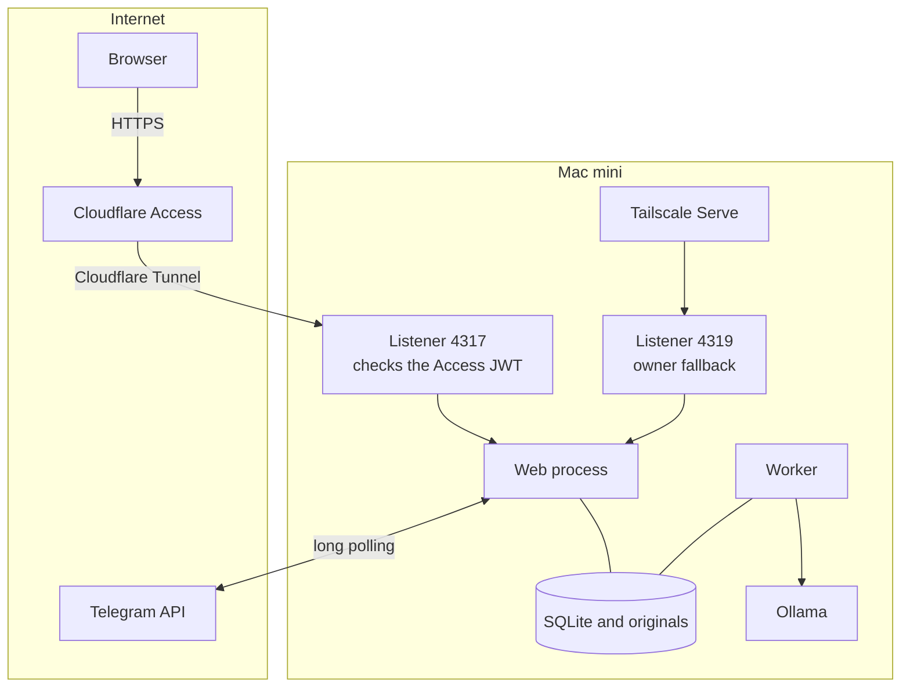

The server listens only on loopback. Each listener accepts one type of identity:

- Listener 4317 accepts only a Cloudflare Access JWT. It does not accept Tailscale headers.
- Listener 4319 accepts only the Tailscale login that you configure.

Do not send Cloudflare Tunnel to port 4319.

## Data model

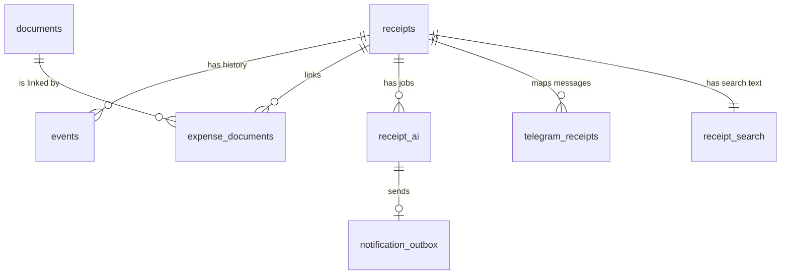

- `documents` holds one row for each original file. The file name on the disk is the SHA-256 hash.
- `receipts` holds the bookkeeping values as JSON, the version number and the Trash time.
- `events` holds the audit history. Each field change has a "from" value and a "to" value.

## Requirements

- macOS with the Xcode command line tools. The app uses Apple Vision, PDFKit and the Swift compiler.
- Node.js 24 or later. The app uses the `node:sqlite` module. It has no npm dependencies.
- [Ollama](https://ollama.com) with a vision model for recognition. You can save and review receipts without Ollama.
- A Telegram bot token from [@BotFather](https://t.me/BotFather) for the bot.

## Install and start

1. Clone the repository:

   ```sh
   git clone https://github.com/bodhiforge/receiptbox.git
   cd receiptbox
   ```

2. Compile the Swift helpers:

   ```sh
   npm run build:native
   ```

3. Download the model:

   ```sh
   ollama pull qwen3.5:4b
   ```

4. Start the web process:

   ```sh
   npm start
   ```

5. To use recognition, start the worker in a second terminal:

   ```sh
   RECEIPTBOX_LOCAL_AI=1 npm run worker
   ```

6. Open `http://127.0.0.1:4317`.

The app keeps its data in `./data`. To use a different folder, set `RECEIPTBOX_DATA`. To connect the Telegram bot, open **Settings**. The bot needs an authenticated origin (see the next section).

## Configuration

| Variable | Use |
| --- | --- |
| `PORT` | The loopback port of the web listener. The default is `4317`. |
| `RECEIPTBOX_DATA` | The data folder: database, originals, previews, snapshots and bot credentials. |
| `RECEIPTBOX_LOCAL_AI` | Set to `1` to start the recognition queue. |
| `RECEIPTBOX_LOCATION` | The name of the machine that the app shows for the data location. |
| `RECEIPTBOX_PUBLIC_ORIGIN` | The HTTPS origin that people open. |
| `RECEIPTBOX_ALLOWED_LOGIN` | The Tailscale login that can use the app. Set it with `RECEIPTBOX_PUBLIC_ORIGIN`. |
| `RECEIPTBOX_ACCESS_ISSUER`, `RECEIPTBOX_ACCESS_AUDIENCE` | The values that the app uses to verify the Cloudflare Access JWT. |
| `RECEIPTBOX_OWNER_EMAIL` | The email of the owner. Only the owner can manage members and empty Trash. |
| `RECEIPTBOX_TAILSCALE_PORT`, `RECEIPTBOX_TAILSCALE_ORIGIN` | The optional owner fallback through Tailscale. |

## Release and deployment

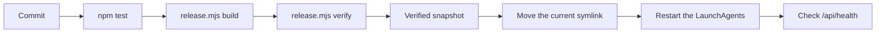

A release is a folder that does not change. Its name contains a hash of all its files.

1. Build a release:

   ```sh
   node src/release.mjs build . ~/receiptbox/releases
   ```

2. Verify the release:

   ```sh
   node src/release.mjs verify ~/receiptbox/releases/<id>
   ```

3. Make a verified snapshot.
4. Move the `current` symlink to the new release.
5. Restart the web and worker LaunchAgents. The templates are in [`launchd/`](launchd/).

Do not start an old release with a newer database schema. The old release cannot read it. The full procedure and the rollback are in [docs/architecture.md](docs/architecture.md#releases-and-rollback).

After a reboot, unlock FileVault with your password. User LaunchAgents start only after the user session starts.

## Backups

`src/backup.mjs` makes a consistent copy of the database. It also copies the originals that the database uses. Then it verifies the copy:

- SQLite integrity check
- foreign key check
- SHA-256 check of each original

The snapshots are in `data/snapshots`. The app does not delete old snapshots.

A snapshot on the same disk does not protect you if you lose the Mac. Use `src/recovery.mjs` to put a snapshot in an encrypted restic repository:

```sh
node src/recovery.mjs init    /private/backup-config.json
node src/recovery.mjs backup  /private/backup-config.json /path/to/verified/snapshot
node src/recovery.mjs check   /private/backup-config.json
node src/recovery.mjs restore /private/backup-config.json SNAPSHOT_ID /new/empty/folder
```

The configuration file contains `repository`, `passwordFile` and, if necessary, `binary`. Snapshots and backups never contain the bot credentials.

## Project layout

```text
src/        web process, worker and domain modules
public/     web client, logo and fonts (no build step)
native/     Swift helpers for OCR images and previews
scripts/    demo, integration, migration and runtime checks
test/       node:test suites
launchd/    LaunchAgent templates
docs/       architecture and changelog
```

## Tests

```sh
npm run check
npm test
```

`npm run check` examines the syntax of each module. `npm test` uses temporary data folders and a fictional Telegram transport.

- The native preview test runs only if `bin/receipt-preview` is available.
- The encrypted backup test runs only if restic is installed.

## Limits

- Recognition can make errors. Receipts that are blurred, faded, handwritten or cut can need correction.
- A filed receipt is a record of an expense. It is not a tax decision.
- The app does not convert currencies, reconcile bank statements or prepare tax returns.
- Telegram is a third-party service. Local recognition does not make Telegram end-to-end encrypted.
- The interface is in English. The bot also accepts some Chinese field names.

## More information

- [docs/architecture.md](docs/architecture.md): storage, queue, authentication, releases and rollback.
- [docs/changelog.md](docs/changelog.md): each change of behavior.

## License

[MIT](LICENSE). The IBM Plex fonts use the [SIL Open Font License](public/IBM-Plex-OFL.txt).
